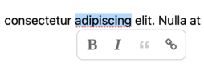

# `prosemirror-selection-menu`

A plugin for displaying [`prosemirror-menu`](https://github.com/ProseMirror/prosemirror-menu) items in a floating menu above a selection.

This is sometimes referred to as a Medium-style floating menu. It is appropriate when you want a floating menu to appear above a selection in the editor,
rather than using a menu bar for your whole editor.

This module uses [`prosemirror-menu`](https://github.com/ProseMirror/prosemirror-menu) types and rendering to display the menu so you can repurpose
`MenuElement`s from a regular menu, including all of their rendering.



## Example

An example assuming you have a schema containing `strong` and `em` marks.

```typescript
import { selectionMenu } from 'prosemirror-selection-menu'
import { EditorState, Plugin } from 'prosemirror-state'
import { icons, MenuElement, MenuItem } from 'prosemirror-menu'

const styleMenuItems: MenuElement[] = []
styleMenuItems.push(
	new MenuItem({
		label: 'Bold',
		icon: icons.strong,
		enable: (state) => toggleMark(schema.marks.strong)(state),
		run: toggleMark(schema.marks.strong),
		active(state) {
			return isMarkActive(state, schema.marks.strong)
		},
	})
)
styleMenuItems.push(
	new MenuItem({
		label: 'Italics',
		icon: icons.em,
		enable: (state) => toggleMark(schema.marks.em)(state),
		run: toggleMark(schema.marks.em),
		active(state) {
			return isMarkActive(state, schema.marks.em)
		},
	})
)

const plugins: Plugin[] = []
plugins.push(selectionMenu({
	content: [styleMenuItems],
})

const state = EditorState.create({
	schema,
	plugins,
	doc,
})
```

## Development

I have followed the guide on https://www.sensedeep.com/blog/posts/2021/how-to-create-single-source-npm-module.html for setting
up the project for CommonJS and ESM.
